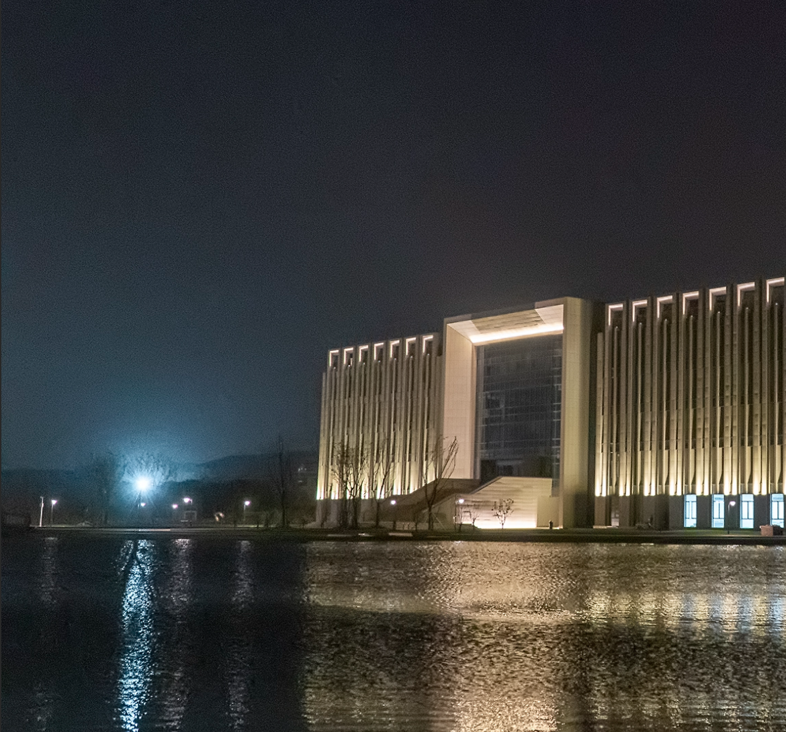
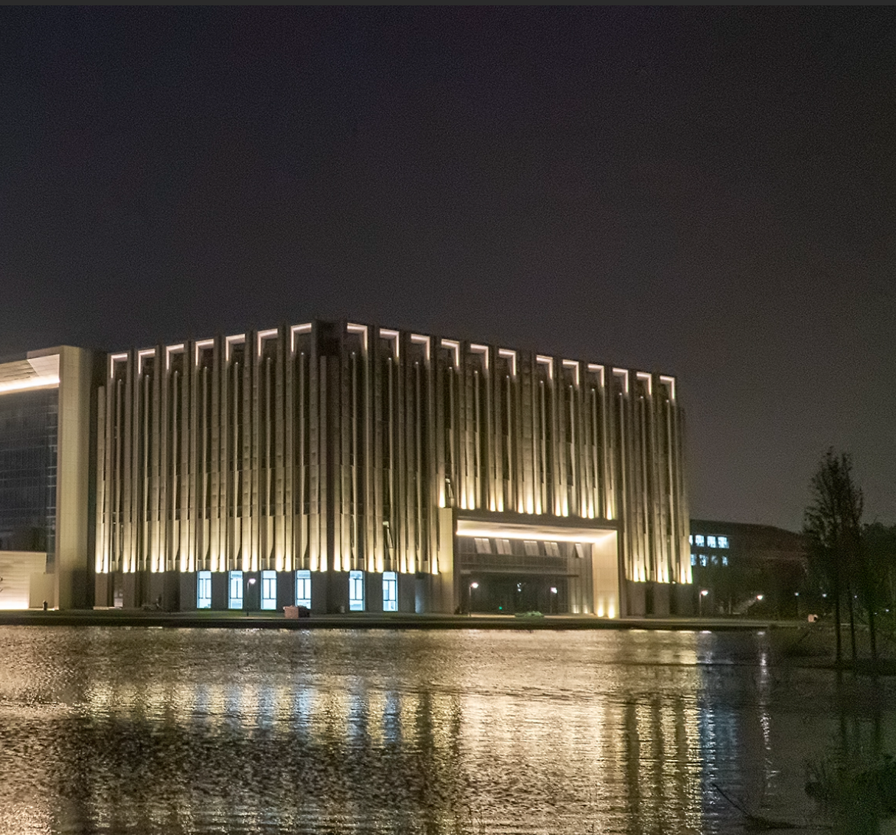
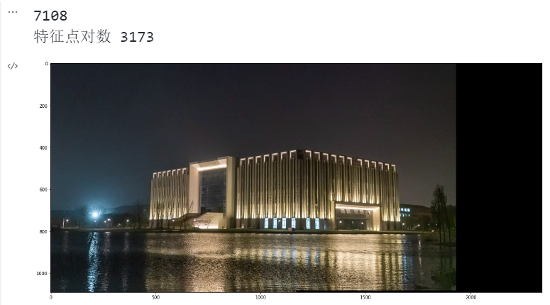

# 计算机视觉实践-练习1 图像拼接
 

> ## *目录*
> 1. 实现方法说明
> 2. 实验细节及结果展示
 

## 1. *实现方法说明*

###  1.1 图像拼接问题
>   图像拼接(image mosaic)是一个日益流行的研究领域，他已经成为照相绘图学、计算机视觉、图像处理和计算机图形学研究中的热点。图像拼接解决的问题一般式，通过对齐一系列空间重叠的图像，构成一个无缝的、高清晰的图像，它具有比单个图像更高的分辨率和更大的视野.图像拼接问题主要涉及以下几个原理:图像滤波,图形变换等.  
### 1.2 实现方法
>   本次练习主要通过以下流程实现图像拼接:  
>   + 使用SIFT算法检测图像中的特征点
>   + 使用KNN(K-近邻算法)将关键的与最近邻和次近邻相匹配
>   + 通过比较最近邻距离与次近邻距离的方式筛选出最近邻远优于次近邻的匹配对
>   + 根据投影映射关系，使用计算出来的单应性矩阵H进行透视变换，再进行拼接

### 1.3 SIFT算法
 >  尺度不变特征转换(SIFT, Scale Invariant Feature Transform)是图像处理领域中的一种局部特征描述算法.SIFT算法不仅只有尺度不变性，当旋转图像，改变图像亮度，移动拍摄位置时，仍可得到较好的检测效果.主要包括以下几个步骤：
 >  + 尺度空间极值检测：通过构建高斯金字塔和DoG（差分高斯）金字塔，检测图像中不同尺度下的极值点，即局部最大或最小值。
 >  + 关键点定位：在尺度空间极值点的基础上，通过对DoG图像进行二阶倒数Hessian矩阵的计算，找到具有高稳定性和高特异性的关键点，以此对尺度、位置和方向进行精确定位。
 >  + 方向分配：针对每个关键点，通过计算其周围像素的梯度方向直方图，确定其主要梯度方向，并将关键点的方向属性赋值为主方向。
 >  + 特征描述：通过将关键点周围的图像区域分成小块，并对每个小块内的像素进行方向归一化和高斯加权，生成128维的特征向量，表示该关键点的图像特征。

 ### 1.4 KNN算法
 >  k 近邻法 (k-nearest neighbor, k-NN） 是一种基本分类与回归方法。是数据挖掘技术中原理最简单的算法之一，核心功能是解决有监督的分类问题。KNN能够快速高效地解决建立在特殊数据集上的预测分类问题，但其不产生模型.  
 >  算法的输入为实例的特征向量，对应与特征空间的点；输出为实例的类别，可以取多类。算法的三个基本要素为：k 值的选择、距离度量及分类决策规则。
 >  算法的主要过程:  
 >  + 计算训练样本和测试样本中每个样本点的距离（常见的距离度量有欧式距离，马氏距离等）；
 >  + 对上面所有的距离值进行排序；
选前k个最小距离的样本；
 >  + 根据这k个样本的标签进行投票，得到最后的分类类别；
 

 ## 2. *实验细节及结果展示*
### 2.1 实验细节
>   本次实验借助python的opencv库实现,其余用到的库有:numpy和matplotlib.  
>   实验是产生的问题:  
>   + 拼接的两张图片尺寸需一致,不然在拼接时会报错
>   + 拼接的两张图片合适的匹配点需大于4(即存在重复区域)
### 2.2 结果展示
  
  

 