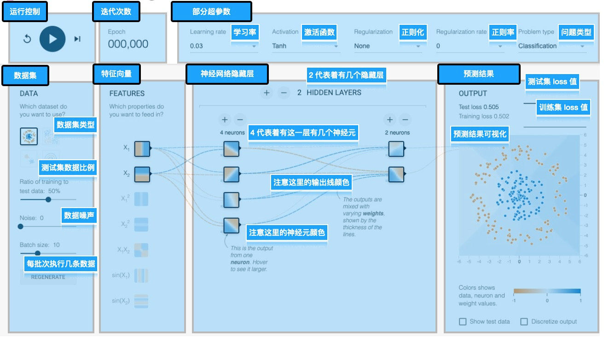
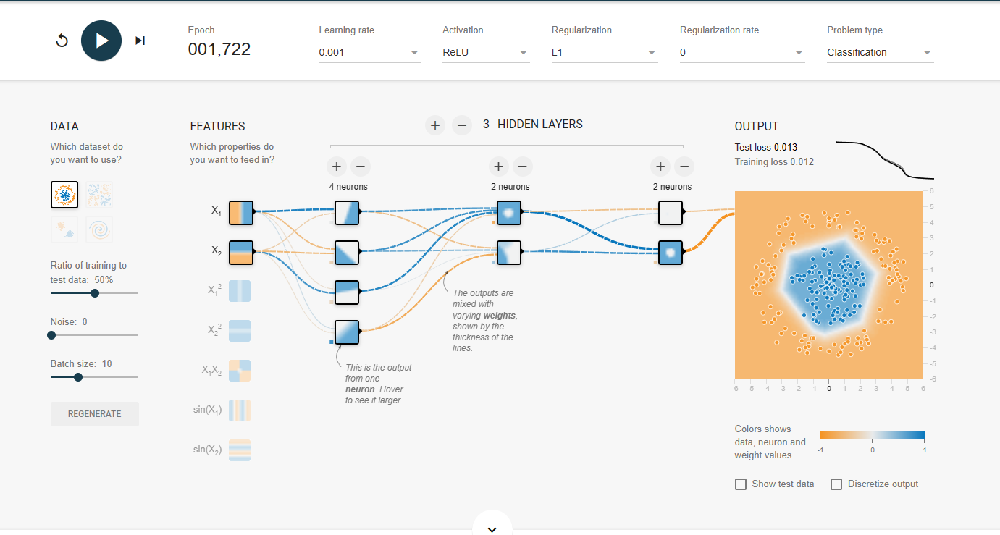
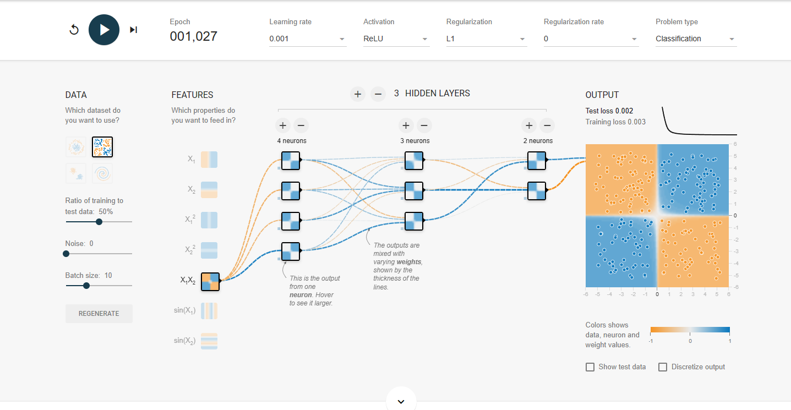
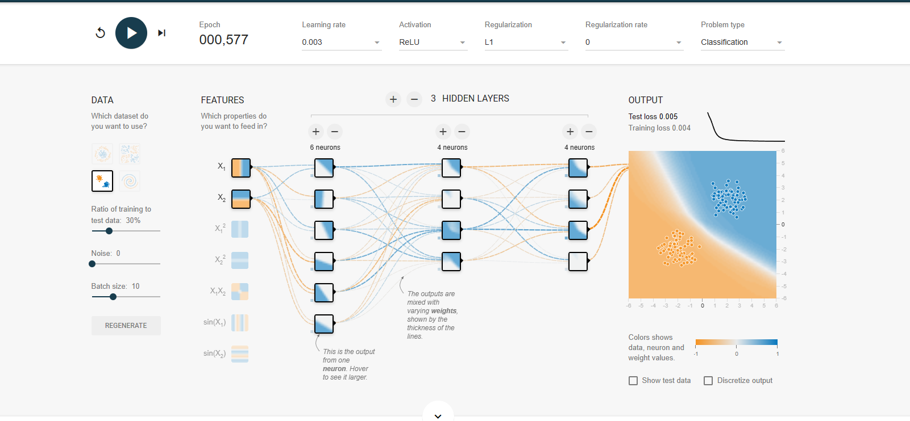
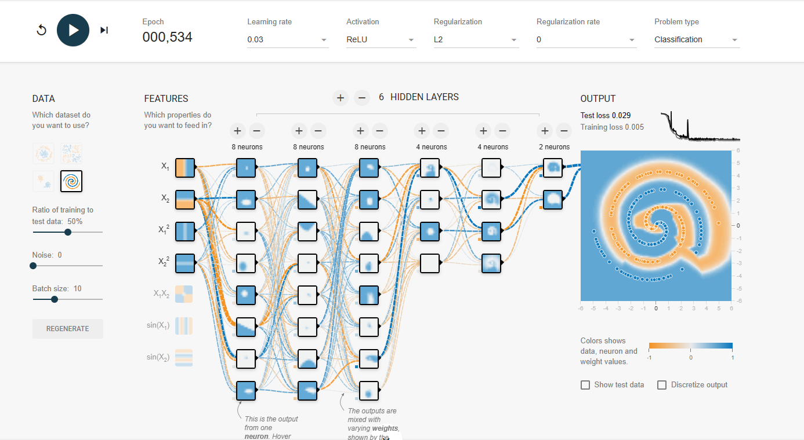
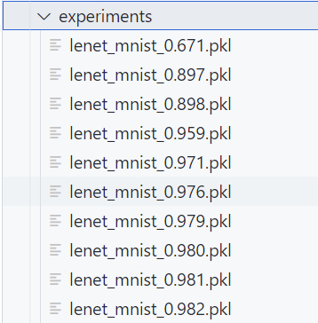

# *练习二: Tensorflow Playground & LeNet-5*

## 目录
> 一 使用Tensorflow Playground  
> 二 LeNet-5  
>   1. 网络结构  
>   2. MNIST数据集  
>   3. 训练  
>   4. 代码  
>   5. 实验结果及其分析

## **一 试用Tensorflow Playground**

**Tensorflow Playground**又名TensorFlow游乐场，是一个用来图形化教学的简单神经网络在线演示和实验的平台，非常强大且极其易用，在这个超级易懂的 demo 里，我们可以快速体验一个算法工程师的调参工作。
对Tensorflow Playground进行一个细致的布局划分，总体上有如下区域：  
> - 运行控制区，这里主要对算法执行进行控制，可以启动、暂停和重置
> - 迭代次数展示区，这里展示当前算法执行到了哪一次迭代
> - 超参数选择区，这里可以调整算法的一些超参数，不同的超参能解决不同的算法问题，得到不同的效果
> - 数据集调整区，数据集定义了我们要解决怎样的问题，数据集是机器学习最为重要的一环
> - 特征向量选择，从数据集中攫取出的可以用来被训练的特征值
> - 神经网络区域，算法工程师构建的用于数据拟合的网络
> - 预测结果区，展示此算法的预测结果  

> Tensorflow Playground提供了四种不同的数据集，通过调参可以对数据集进行拟合。通过调试，得到对四个数据集的拟合结果如下图所示：  

## **LeNet-5**
### 1 LeNet-5网络结构
**Lenet-5**是一种经典的卷积神经网络，由Yann LeCun等人于1998年提出，是深度学习的先驱之一。它主要用于手写数字识别的任务，但也被广泛应用于其他图像分类任务。
Lenet-5网络结构包含7层，分别是：
> 1. 输入层（Input Layer）：28×28的灰度图像。
> 2. 卷积层1（Convolutional Layer 1）：6个卷积核，大小为5×5，步长为1，无填充（padding），激活函数使用Sigmoid函数。
> 3. 池化层1（Pooling Layer 1）：2×2最大池化，步长为2。
> 4. 卷积层2（Convolutional Layer 2）：16个卷积核，大小为5×5，步长为1，无填充，激活函数使用Sigmoid函数。
> 5. 池化层2（Pooling Layer 2）：2×2最大池化，步长为2。
> 6. 全连接层1（Fully Connected Layer 1）：120个神经元，激活函数使用Sigmoid函数。
> 7. 全连接层2（Fully Connected Layer 2）：84个神经元，激活函数使用Sigmoid函数。
> 8. 输出层（Output Layer）：10个神经元，代表数字0~9的分类结果，激活函数使用Softmax函数。  
### 2 MNIST数据集
**MNIST数据集**是一个常用的手写数字识别数据集，是深度学习领域最经典的数据集之一，由Yann LeCun等人收集整理。该数据集包含60000张训练图像和10000张测试图像，每张图像都是28x28像素大小的灰度图像，标记为0~9中的一个数字。  
**MNIST数据集**的目的是用于机器学习算法的性能测试和比较，同时也是许多深度学习算法的基准数据集之一。它被广泛用于图像识别、字符识别、手写文字识别等领域的研究和应用。
### 3 训练
本次实验中解决的是一个多分类问题因此选择**交叉熵（CrossEntropy）**作为损失函数，其公式如下图所示：  
  
其中𝑀表示类别的数量，𝑦𝑖𝑐是符号函数，如果分类正确取 1，错误取 0，𝑝𝑖𝑐是观测样本属于对应类别的预测概率。在网络训练过程中，对损失函数进行梯度下降进行优化，训练网络中的权值。  
**本次实验选择SGD（随机梯度下降）作为训练的优化器**，其主要思想是在每次更新模型参数时，使用随机选择的一小批训练样本来计算梯度，从而加速模型训练。  
具体来说，SGD算法在每次迭代中从训练集中随机选择一个小批量的样本进行计算，然后使用这个小批量样本计算损失函数对模型参数的偏导数，即梯度。然后，使用这个梯度来更新模型的参数，以使损失函数最小化。这个过程重复多次，直到达到预定的停止条件（如达到最大迭代次数、损失函数变化小于某个阈值等）为止。  
与批量梯度下降（Batch Gradient Descent）相比，SGD的主要优点是计算效率更高，因为它每次只计算一小批样本的梯度，而不是计算全部样本的梯度。另外，SGD在遇到大规模数据集时，通常比批量梯度下降更容易收敛到局部最优解。但是，由于随机选择的小批量样本具有一定的噪声，因此SGD的收敛过程可能会比较不稳定，需要经过一定的调参来优化算法的性能。
### 4 代码
定义Lenet-5网络模型及forward函数代码：  
~~~
class Model(Module):
    def __init__(self):
        super(Model, self).__init__()
        self.conv1 = nn.Conv2d(1,6, 5)
        self.relu1 = nn.ReLU()
        self.pool1 = nn.MaxPool2d(2)
        self.conv2 = nn.Conv2d(6, 16, 5)
        self.relu2 = nn.ReLU()
        self.pool2 = nn.MaxPool2d(2)
        self.fc1 = nn.Linear(256, 120)
        self.relu3 = nn.ReLU()
        self.fc2 = nn.Linear(120, 84)
        self.relu4 = nn.ReLU()
        self.fc3 = nn.Linear(84, 10)
        self.relu5 = nn.ReLU()

    def forward(self, x):
        y = self.conv1(x)
        y = self.relu1(y)
        y = self.pool1(y)
        y = self.conv2(y)
        y = self.relu2(y)
        y = self.pool2(y)
        y = y.view(y.shape[0], -1)
        y = self.fc1(y)
        y = self.relu3(y)
        y = self.fc2(y)
        y = self.relu4(y)
        y = self.fc3(y)
        y = self.relu5(y)
        return y
~~~
使用Dataloader读取数据集，并定义训练器：
~~~
    train_dataset = mnist.MNIST(root='D:\pythonProject\ComputerVision\Test2\\train', train=True, download=True, transform=ToTensor())
    test_dataset = mnist.MNIST(root='D:\pythonProject\ComputerVision\Test2\\test', train=False, download=True, transform=ToTensor())
    train_loader = DataLoader(train_dataset, batch_size=batch_size)
    test_loader = DataLoader(test_dataset, batch_size=batch_size)
    model = Model().to(device)
    sgd = SGD(model.parameters(), lr=1e-1)
    loss_fn = CrossEntropyLoss()
    all_epoch = 100
    prev_acc = 0
~~~
迭代训练：
~~~
    for current_epoch in range(all_epoch):
        model.train()
        for idx, (train_x, train_label) in enumerate(train_loader):
            train_x = train_x.to(device)
            train_label = train_label.to(device)
            sgd.zero_grad()
            predict_y = model(train_x.float())
            loss = loss_fn(predict_y, train_label.long())
            loss.backward()
            sgd.step()
        
        
        all_correct_num = 0
        all_sample_num = 0
        model.eval()
~~~
测试模型：
~~~
        for idx, (test_x, test_label) in enumerate(test_loader):
            test_x = test_x.to(device)
            test_label = test_label.to(device)
            predict_y = model(test_x.float()).detach()
            predict_y =torch.argmax(predict_y, dim=-1)
            current_correct_num = predict_y == test_label
            all_correct_num += np.sum(current_correct_num.to('cpu').numpy(), axis=-1)
            all_sample_num += current_correct_num.shape[0]
~~~
打印loss并将训练结果保存在experiments文件夹下：
~~~
        acc = all_correct_num / all_sample_num
        print('accuracy: {:.3f}'.format(acc), flush=True)
        # 修改为保存实验的文件夹路径
        if not os.path.isdir("experiments"):
            os.mkdir("experiments")
        torch.save(model, 'experiments/lenet_mnist_{:.3f}.pkl'.format(acc))
        if np.abs(acc - prev_acc) < 1e-4:
            break
        prev_acc = acc
    print("Model finished training")
~~~
### 5 实验结果及分析
**实验结果**如下图所示：  
  

我们可以看到，在MNIST数据集上经过十轮训练后，Lenet-5网络可以达到0.982的准确度，说明该模型在手写数字识别这一任务上能得到出色的效果。

