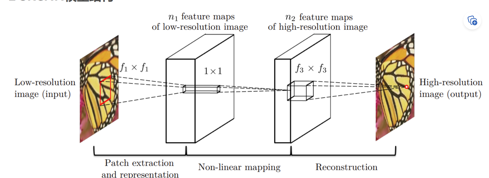
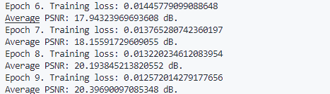
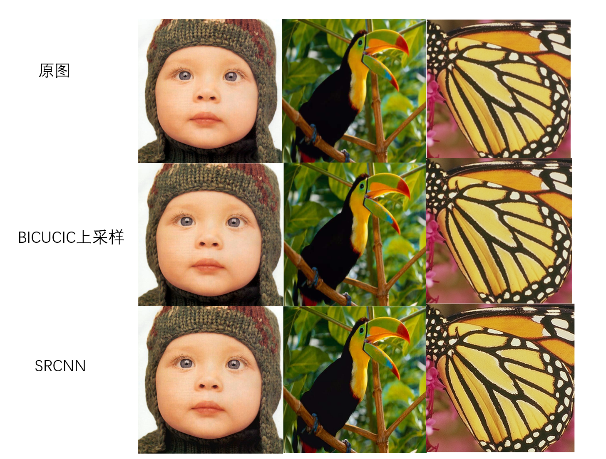
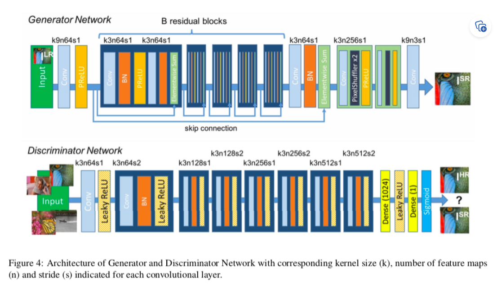
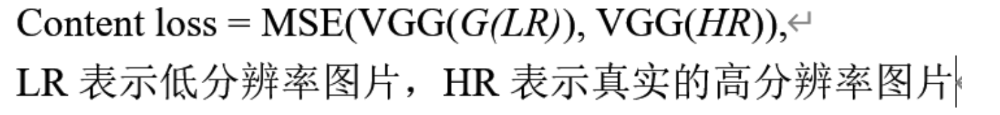
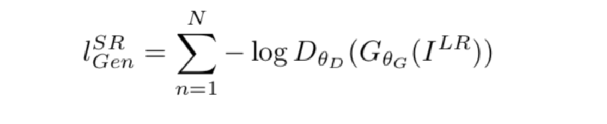
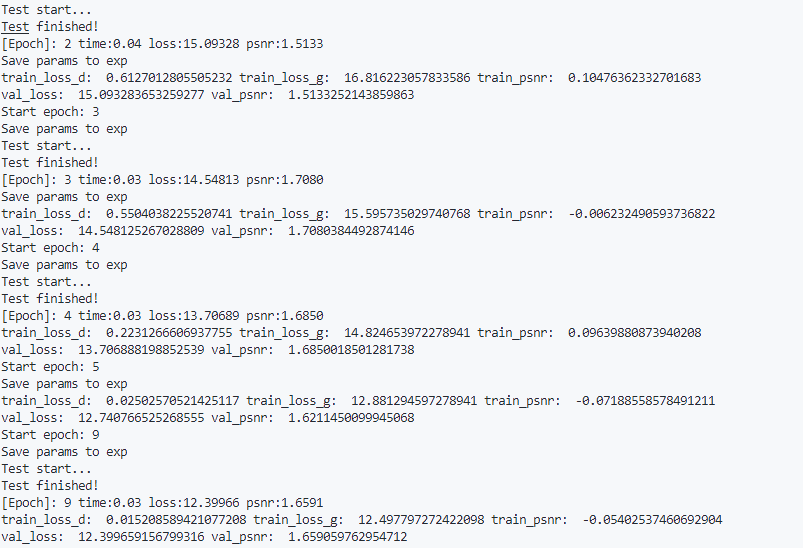
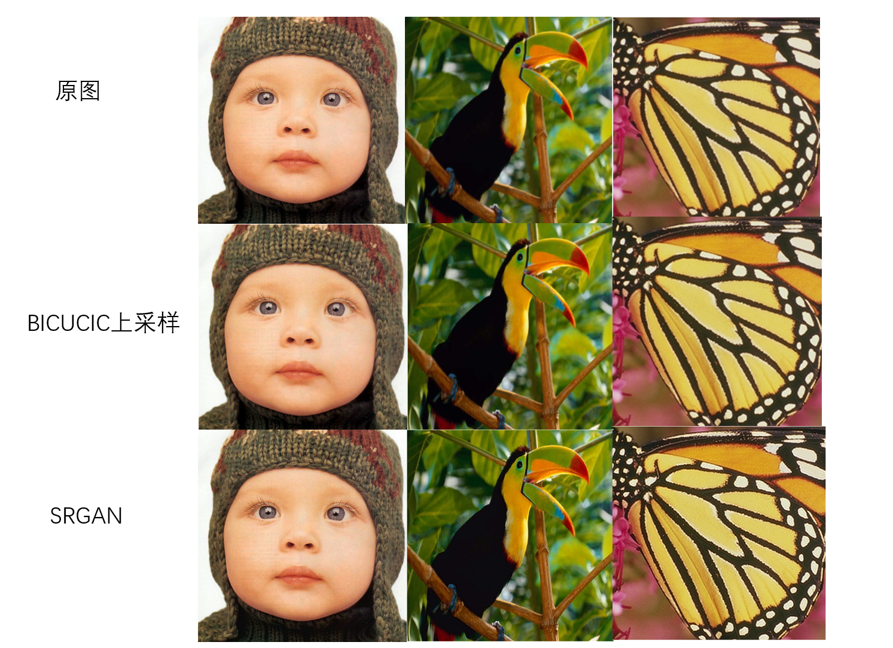

# 图像超分辨率算法
## 目录
> 1. SRCNN
>   1.1 网络结构
>   1.2 具体实现
>   1.3 实验结果
> 2. SRGAN
>   2.1 网络结构
>   2.2 具体实现
>   2.3 实验结果
> 3. 比较分析 
## 1. SRCNN
### 1.1 网络结构
SRCNN网络是在2014年提出的,是将深度学习引入超分辨率领域的第一个工作,其效果证明了深度学习在超分领域的应用可以超越传统的插值等办法取得较高的表现力。  
SRCNN具有结构简单且失真率低的特点.在一定数量的卷积层结构
下，SRCNN可以达到fast-training.  
实验表明，在一定范围内，越大的数据集和较大的网络模型可以提升SRCNN对图像的重建效果.  
SRCNN网络由三个模块组成,分别为:特征提取层,非线性映射层,图像重建层.以下是对三层的介绍:  
> 1. 特征提取层用了一层的CNN以及ReLU去将图像Y YY变成一堆堆向量，即feature map. 经过这一层，图像Y YY的大小以及通道数都会发生改变,m a x ( 0 , x ) max(0,x)max(0,x)表示ReLU层。  
> 2. 非线性映射层就是将上一层的feature map再用卷积核过滤一次以及ReLU层进行激活，也可以理解为为了加深网络从而更好的学习函数F.大致结构和特征提取层一样，不一样的是这一层只是为了增加网络模型的非线性程度，所以只需采用1 × 1 1\times 11×1的卷积核就可以了，其通道数为n1,一个有n2个滤波器.  
> 3. 图像重建层借鉴于传统超分的纯插值办法——对图像局部进行平均化的思想，其本质就是乘加结合的方式,这一层是不需要ReLU层的,也可以从另一个角度来考虑，经过前面的卷积之后，图像的size变小了，因此需要上采样过程来恢复图像，势必需要一个反卷积来做这件事，而反卷积本质也是卷积的一种。 
>  

### 1.2 具体实现
参考以上对SRCNN网络的描述,**本次实验实现的SRCNN网络代码如下:**  
~~~
class SRCNN(nn.Module):
    def __init__(self) -> None:
        super(SRCNN, self).__init__()
        self.conv1 = nn.Sequential(nn.Conv2d(in_channels=1, out_channels=64, kernel_size=9, 
                                             padding=4, padding_mode="replicate"),
                                             nn.ReLU(inplace=True))
        self.conv2 = nn.Sequential(nn.Conv2d(in_channels=64, out_channels=32, kernel_size=1, padding=0),
                                   nn.ReLU(inplace=True))
        self.conv3 = nn.Conv2d(in_channels=32, out_channels=1, kernel_size=5, padding=2)

    def forward(self, x):
        x = self.conv1(x)
        x = self.conv2(x)
        x = self.conv3(x)
        return x 
~~~

本次实验选取MSE作为损失函数,原因是MSE的格式和我们图像失真评价指标PSNR很像，因此可以理解为SRCNN是直接冲着提升PSNR去的，从而让高分辨率的图像有较小的失真度。MSE就是迫使网络将我们恢复的SR图像向着Ground-Truth的方向靠近.  
**训练代码如下所示:**
~~~
train_set = DatasetFromFolder("dataset/T91", zoom_factor=args.zoom_factor)
test_set = DatasetFromFolder("dataset/Set5", zoom_factor=args.zoom_factor)

train_loader = DataLoader(dataset=train_set, batch_size=BATCH_SIZE, shuffle=True, num_workers=NUM_WORKERS)
test_loader = DataLoader(dataset=test_set, batch_size=BATCH_SIZE, shuffle=True, num_workers=NUM_WORKERS)

model = SRCNN().to(device)
criterion = nn.MSELoss()
optimizer = optim.Adam(
    [
        {"params":model.conv1.parameters(), "lr":0.0001},
        {"params": model.conv2.parameters(), "lr": 0.0001},
        {"params": model.conv3.parameters(), "lr": 0.00001},
    ], lr=0.00001,
)

for epoch in range(args.num_epochs):
    # train
    epoch_loss = 0
    for iter, batch in enumerate(train_loader):
        input, target = batch[0].to(device), batch[1].to(device)
        optimizer.zero_grad()

        out = model(input)
        loss = criterion(out, target)
        loss.backward()
        optimizer.step()
        epoch_loss += loss.item()

    print(f"Epoch {epoch}. Training loss: {epoch_loss / len(train_loader)}")

    # test
    avg_psnr = 0
    with torch.no_grad():
        for batch in test_loader:
            input, target = batch[0].to(device), batch[1].to(device)

            out = model(input)
            loss = criterion(out, target)
            psnr = 10 * log10(1 / loss.item())
            avg_psnr += psnr
    
    
        print(f"Average PSNR: {avg_psnr / len(test_loader)} dB.")

~~~
### 1.3 实验结果
经过在T91数据集上的10轮epoch训练可以得到以下结果:  
  
可以看到PSNR为20.4左右.
在Set-5数据集上测试可以得到以下结果:  
  
从结果可以看到,SRCNN的效果并不明显,但其在PSRN指标上可以取得很好的成绩.
## 2. SRGAN
### 2.1 网络结构
SRGAN是一个将生成对抗学习用于基于单幅图像的高分辨重建，不同于传统的CNN的方法，SRGAN得到的超分辨率的图片放大四倍之后还是能够体现细节感。  
网络结构:  
    **生成网络部分**：SRResnet，由残差结构，BN，PReLU组成，用于实现高分辨率的生成。  
    **判别器部分**：由大量卷积层，Leaky ReLU,BN等结构组成，用于判别图像的真实性  
  
亮点:
> 1. 训练了一个SRResnet，由Resnet生成的一张恢复高分辨率的图片，然后将这张图片与GT传入Vgg网络中，训练一个MSE loss 最小。
> 2. 重新设计了Loss，将features map的MSE Loss，与对抗网络的Loss结合。  
> 
**损失函数**:又两部分组成,content loss和adversatial loss.
> content loss:是生成的HR和真实的HR通过VGG网络前16层得到的特征之间的MSE损失，可以表示为:  
  
> adversarial loss:对抗网络部分的loss为判别器判别loss，即当生成器生成的图片，判别器认为为真实的图片时，该loss取得最小。  

### 2.2 具体实现
SRGAN的实现分为两部分,首先是生成网络的实现,其由ResNet实现,通过5个残差块和若干个上采样模块实现,具体代码如下:  
~~~
class Generator(nn.Module):
    def __init__(self, scale=1) -> None:
        """放大倍数为scale的平方"""

        upsample_block_num = int(math.log(scale, 2))

        super().__init__()
        self.conv1 = nn.Sequential(
            nn.Conv2d(in_channels=3, out_channels=64, kernel_size=9, stride=1, padding=4),
            nn.PReLU()
        )
        self.residual_blocks = nn.Sequential(
            Block(),
            Block(),
            Block(),
            Block(),
            Block()
        )
        self.conv2 = nn.Sequential(
            nn.Conv2d(in_channels=64, out_channels=64, kernel_size=3, stride=1, padding=1),
            nn.BatchNorm2d(64)

        )
        conv3 = [UpsampleBLock(64, 2) for _ in range(upsample_block_num)]
        self.conv3 = nn.Sequential(*conv3) 
        self.conv4 = nn.Conv2d(64, 3, 9, stride=1, padding=4)

    def forward(self, x):
        x0 = self.conv1(x)
        x = self.residual_blocks(x0)
        x = self.conv2(x)
        x = self.conv3(x + x0)
        x = self.conv4(x)
        return (torch.tanh(x)+1) /2
~~~
然后是鉴别网络,主要由若干卷积层和leakyRelu层组成,具体实现代码如下所示:
~~~
class DownSalmpe(nn.Module):
    def __init__(self, input_channel, output_channel,  stride, kernel_size=3, padding=1):
        super().__init__()
        self.layer = nn.Sequential(
            nn.Conv2d(input_channel, output_channel, kernel_size, stride, padding),
            nn.BatchNorm2d(output_channel),
            nn.LeakyReLU(inplace=True)
        )

    def forward(self, x):
        x = self.layer(x)
        return x

class Discriminator(nn.Module):
    def __init__(self):
        super().__init__()
        self.conv1 = nn.Sequential(
            nn.Conv2d(3, 64, 3, stride=1, padding=1),
            nn.LeakyReLU(inplace=True),
        )
        self.down = nn.Sequential(
            DownSalmpe(64, 64, stride=2, padding=1),
            DownSalmpe(64, 128, stride=1, padding=1),
            DownSalmpe(128, 128, stride=2, padding=1),
            DownSalmpe(128, 256, stride=1, padding=1),
            DownSalmpe(256, 256, stride=2, padding=1),
            DownSalmpe(256, 512, stride=1, padding=1),
            DownSalmpe(512, 512, stride=2, padding=1),
        )
        self.dense = nn.Sequential(
            nn.AdaptiveAvgPool2d(1),
            nn.Conv2d(512, 1024, 1),
            nn.LeakyReLU(inplace=True),
            nn.Conv2d(1024, 1, 1),
            nn.Sigmoid()
        )

    def forward(self, x):
        x = self.conv1(x)
        x = self.down(x)
        x = self.dense(x)
        return x
~~~
Content Loss的具体实现代码如下:
~~~
class ContentLoss(nn.Module):
    def __init__(self, device):
        super().__init__()
        self.mse = nn.MSELoss()
        self.vgg19 = VGG(device)

    def forward(self, fake, real):
        feature_fake = self.vgg19(fake)
        feature_real = self.vgg19(real)
        loss = self.mse(feature_fake, feature_real)
        return loss
~~~
Adversarial Loss的实现:
~~~
class AdversarialLoss(nn.Module):
    def __init__(self):
        super().__init__()

    def forward(self, x):
        loss = torch.sum(-torch.log(x))
        return loss
~~~
### 2.3 实验结果
在T91数据集上经过10轮训练得到以下结果:  
  
在Set5数据集上进行测试结果如下:  

## 3. 比较分析
SRCNN作为将深度学习引入超分领域的第一个工作,其主要关注的是对PSNR指标的提升,相较于传统的插值方法可以取得更好的效果,但其对于人眼观察的提升效果并不是很理想.  
SRGAN是实现重建图像photo-realistic的首篇文章,其实现了在up-scale factor较大情况下，图像能有更多的重建细节,因此尽管在PSNR并不高的情况下，产生让人肉眼感官更加舒适的HR图像,这也反映了PSNR/SSIM并不能体现photo-realistic图像的质量.
