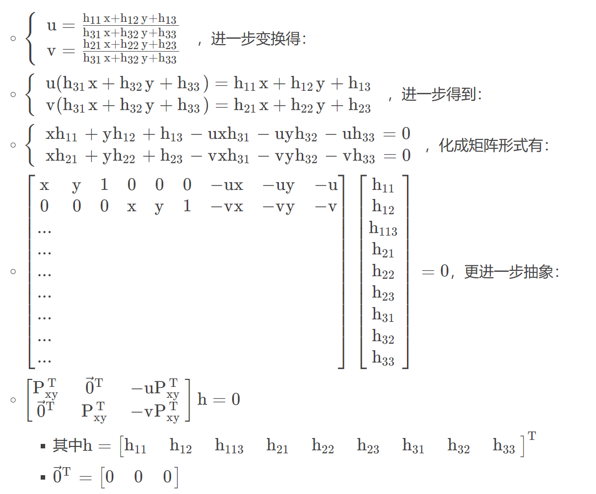

# 实验四：图像单应性变换
## **目录**
> 1. 单应性变换概念
> 2. 实验代码实现
> 3. 实验结果分析

## 1. **单应性变换概念**
**单应性变换(homography transformation)又叫投影变换是**指在平面上进行的一种仿射变换，可以将一个平面上的点映射到另一个平面上的对应点。在计算机视觉领域，单应性变换经常用于图像处理和计算机视觉应用中，例如图像配准、图像拼接、三维重建等.  
单应性变换是在三元素向量的齐次坐标下进行的线性变换，他由一个3×3的非奇异变换矩阵H表示，具体如下：  
  
- **单应性矩阵**
  - 单应矩阵描述两个平面上的对应点之间的变换关系；
  - 同一个平面在任意坐标系之间都可以建立单应性变换关系；
  - 如下图上的X点可以通过单应性矩阵H1和H2变换为image1和image2。  
  
- **求解单应性矩阵**
  - 首先，我们假设两张图像中的对应点对齐次坐标为P_{xy}=(x,y,1)^{T}P_{xy}=(x,y,1)^{T}和 P_{uv}=(u,v,1)^{T},单应矩阵H定义为:  
    
  - 这里使用的是齐次坐标系，也就是说可以进行任意尺度的缩放（s为尺度因子），也就是说把H乘以任意一个非零常数k并不改变上式结果，无非就是尺度因子s有所改变。  
  - 比如我们把H乘以\frac{1}{h33}可以得到:  
  
    - 而上述等式依然成立.
  - 同理H乘以\frac{1}{\sum_{i=1}^{3}\sum_{j=1}^{3}h_{ij}^{2}}可以得到约束:
  
  - 由此我们可以得出单应性矩阵有8个自由度，并非9个自由度。
- **求解**
  - 由3.1中假设公式（1）可得:
  
  - 我们发现一对点可以提供两个方程,因此根据上式的线性方程组8自由度的H我们至少需要4对点才能计算出单应矩阵。  

## **2. 实验代码实现**
**在本次实验过程中**我选择使用ORB算法获得图片的特征点，然后使用暴力匹配和knn算法获取两张图片的匹配特征点对个数，当匹配特征点对数大于阈值时，对两张图片进行单应性映射。求解单应性方程的过程由opencvku中的findHomography方法实现。  

在读入图片后使用orb算法获得图片特征点的代码如下： 
~~~
    kp1, des1 = orb.detectAndCompute(query_img, None)
    kp2, des2 = orb.detectAndCompute(train_img, None)
~~~ 

使用暴力匹配和KNN算法获得匹配特征点对个数代码如下：
~~~
    bf = cv2.BFMatcher()
    initial_matches = bf.knnMatch(des1, des2, k=2)
    good_matches = []
    for m, n in initial_matches:
        if m.distance < 0.75*n.distance:
            good_matches.append(m)

~~~
使用opencv中的方法进行单应性映射代码如下：
~~~
        src_pts = np.float32([ kp1[m.queryIdx].pt for m in good_matches ]).reshape(-1,1,2)
        dst_pts = np.float32([ kp2[m.trainIdx].pt for m in good_matches ]).reshape(-1,1,2)

        H_train_to_query, mask_train_to_query = cv2.findHomography(dst_pts, src_pts, cv2.RANSAC,5.0)
        H, mask = cv2.findHomography(src_pts, dst_pts, cv2.RANSAC,5.0)
        matchesMask = mask.ravel().tolist()

        h,w = query_img.shape
        pts = np.float32([ [0,0],[0,h-1],[w-1,h-1],[w-1,0] ]).reshape(-1,1,2)
        dst = cv2.perspectiveTransform(pts,H)
        original_color_img = cv2.polylines(original_color_img,[np.int32(dst)],True,(51,255,255),3, cv2.LINE_AA)

~~~

## **3. 实验结果分析**
在图片裁剪中使用单应性映射结果如下图所示  
原图：  
  
映射结果：  
  
特征匹配：  

