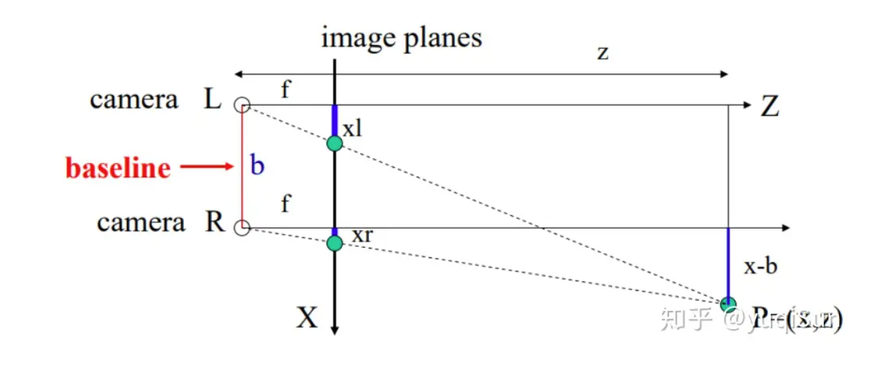
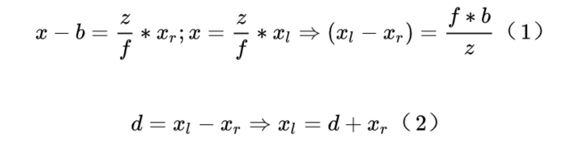
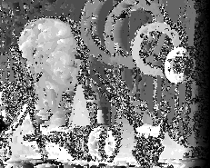

# 实验五：立体匹配
## **目录**
> 1. 立体匹配概念
> 2. 实验代码实现
> 3. 实验结果分析

## **1. 立体匹配概念**
**立体匹配也称作视差估计（disparity estimation），或者双目深度估计**。其输入是一对在同一时刻捕捉到的，经过极线校正的左右图像Il和Ir。而它的输出是由参考图像（一般以左图作为参考图像）中每个像素对应的视差值所构成的视差图d。视差是三维场景中某一点在左右图像中对应点位置的像素级差距。如图所示：  
  
  
如果能够得到视差图d，即可根据公式z=(b*f)/d获得深度图。  
立体匹配可划分为四个步骤：**匹配代价计算、代价聚合、视差计算和视差优化**  
- **匹配代价计算**
   > 匹配代价计算的目的是衡量待匹配像素与候选像素之间的相关性。两个像素无论是否为同名点，都可以通过匹配代价函数计算匹配代价，代价越小则说明相关性越大，是同名点的概率也越大。  
   > 匹配代价计算的方法有很多，传统的摄影测量中，使用灰度绝对值差（AD，Absolute Differences）1、灰度绝对值差之和（SAD，Sum of Absolute Differences）、归一化相关系数（NCC，Normalized Cross-correlation）等方法来计算两个像素的匹配代价；计算机视觉中，多使用互信息（MI，Mutual Information）法2 3、Census变换（CT，Census Transform）法4 5、Rank变换（RT, Rank Transform）法6 7、BT（Birchfield and Tomasi）法8 等作为匹配代价的计算方法。不同的代价计算算法都有各自的特点，对各类数据的表现也不尽相同，选择合适的匹配代价计算函数是立体匹配中不可忽视的关键步骤。  
   > 这个过程可以视为对深度估计问题空间的初步建模。因为经过矫正之后的立体图片对，参考图像中的某个像素，其对应像素应该在该像素的平行位置。根据一个深度确定两个像素后，即可以用上述的若干种方法计算匹配代价。
- **代价聚合**
  > 代价聚合的根本目的是让代价值能够准确的反映像素之间的相关性。上一步匹配代价的计算往往只会考虑局部信息，通过两个像素邻域内一定大小的窗口内的像素信息来计算代价值，这很容易受到影像噪声的影响，而且当影像处于弱纹理或重复纹理区域，这个代价值极有可能无法准确的反映像素之间的相关性，直接表现就是真实同名点的代价值非最小。  
  > 实际上代价聚合类似于一种视差传播步骤，信噪比高的区域匹配效果好，初始代价能够很好的反映相关性，可以更准确的得到最优视差值，通过代价聚合传播至信噪比低、匹配效果不好的区域，最终使所有影像的代价值都能够准确反映真实相关性。常用的代价聚合方法有扫描线法、动态规划法、SGM算法中的路径聚合法等。  
- **视差计算**
  > 视差计算即通过代价聚合之后的代价矩阵S来确定每个像素的最优视差值，通常使用赢家通吃算法（WTA，Winner-Takes-All）来计算，如图2所示，即某个像素的所有视差下的代价值中，选择最小代价值所对应的视差作为最优视差。这一步非常简单，这意味着聚合代价矩阵S的值必须能够准确的反映像素之间的相关性，也表明上一步代价聚合步骤是立体匹配中极为关键的步骤，直接决定了算法的准确性。  
- **视差优化**
  > 视差优化的目的是对上一步得到的视差图进行进一步优化，改善视差图的质量，包括剔除错误视差、适当平滑以及子像素精度优化等步骤，一般采用左右一致性检查（Left-Right Check）算法剔除因为遮挡和噪声而导致的错误视差；采用剔除小连通区域算法来剔除孤立异常点；采用中值滤波（Median Filter）、双边滤波（Bilateral Filter）等平滑算法对视差图进行平滑；另外还有一些有效提高视差图质量的方法如鲁棒平面拟合（Robust Plane Fitting）、亮度一致性约束（Intensity Consistent）、局部一致性约束（Locally Consistent）等也常被使用。  
  > 由于WTA算法所得到的视差值是整像素精度，为了获得更高的子像素精度，需要对视差值进行进一步的子像素细化，常用的子像素细化方法是一元二次曲线拟合法，通过最优视差下的代价值以及左右两个视差下的代价值拟合一条一元二次曲线，取二次曲线的极小值点所代表的视差值为子像素视差值。

## **2. 实验代码实现**
**1、计算误差能量，生成具有最小平均误差能量的视差图**
~~~
for d in range(dmax):
    ##先计算  e （i,j，d）
    for i in range(size1):
        for j in range(size2):
            sum =0
            for m in range(window_size):
                for n in range(window_size):
                    for k in range(3):
                        x=min(size1-1,i+m)
                        y=min(size2-1,j+n)
                        square_diff=(int(left[x][min(y+d,size2-1)][k])-int(right[x][y][k]))**2
                        sum=sum+square_diff
            e[i][j]=sum/(3*window_size*window_size)

    ##再计算e_avg（i,j，d）
    for i in range(size1):
        for j in range(size2):
            e_temp = 0
            for m in range(window_size):
                for n in range(window_size):
                    x = min(size1-1, i + m)
                    y = min(size2-1, j + n)
                    e_temp=e_temp+e[x][y]
            e_temp=e_temp/(window_size*window_size)
            if e_temp<e_avg[i,j]:
                e_avg[i,j]=e_temp
                disparity[i,j]=d
~~~

**2、计算可靠度，生成可靠视差的视差图**
~~~
ve=alpha*e_avg.mean()
count_not_ne=0
sum_e=0
for i in range(size1):
    for j in range(size2):
        if e_avg[i][j]>ve:
                ######定ne
            disparity[i][j]=0
        else:
            sum_e=sum_e+e_avg[i][j]
            count_not_ne=count_not_ne+1
reliability=float(count_not_ne)**(-1)*sum_e
~~~

## **3. 实验结果分析**
左相机图：  
  
右相机图：  
  
视差图：  
